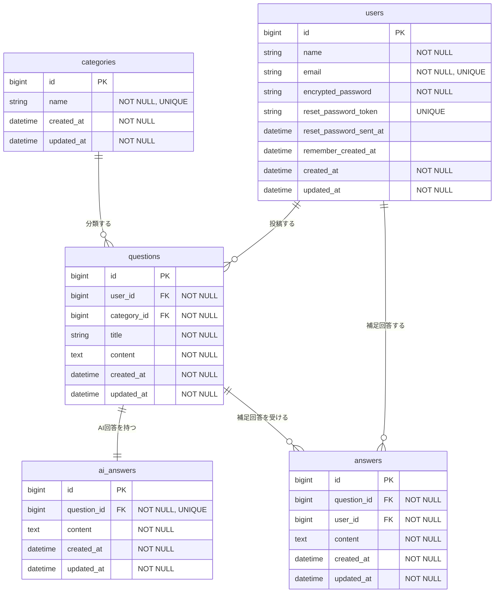

# ER図 - 保険Q&A

```mermaid
erDiagram
    users {
        bigint id PK
        string name "NOT NULL"
        string email "NOT NULL, UNIQUE"
        string encrypted_password "NOT NULL"
        string reset_password_token "UNIQUE"
        datetime reset_password_sent_at
        datetime remember_created_at
        datetime created_at "NOT NULL"
        datetime updated_at "NOT NULL"
    }

    categories {
        bigint id PK
        string name "NOT NULL, UNIQUE"
        datetime created_at "NOT NULL"
        datetime updated_at "NOT NULL"
    }

    questions {
        bigint id PK
        bigint user_id FK "NOT NULL"
        bigint category_id FK "NOT NULL"
        string title "NOT NULL"
        text content "NOT NULL"
        datetime created_at "NOT NULL"
        datetime updated_at "NOT NULL"
    }

    ai_answers {
        bigint id PK
        bigint question_id FK "NOT NULL, UNIQUE"
        text content "NOT NULL"
        datetime created_at "NOT NULL"
        datetime updated_at "NOT NULL"
    }

    answers {
        bigint id PK
        bigint question_id FK "NOT NULL"
        bigint user_id FK "NOT NULL"
        text content "NOT NULL"
        datetime created_at "NOT NULL"
        datetime updated_at "NOT NULL"
    }

    users ||--o{ questions : "投稿する"
    users ||--o{ answers : "補足回答する"
    categories ||--o{ questions : "分類する"
    questions ||--|| ai_answers : "AI回答を持つ"
    questions ||--o{ answers : "補足回答を受ける"
```
